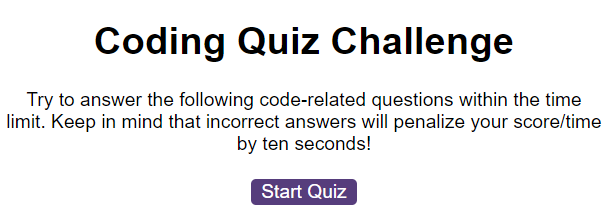

# code-quiz
A timed coding quiz with multiple-choice questions.

This project used JavaScript to write code for an in browser quiz app that test users knowledge
about JavaScript.

 ## Tools used
 The tools used used are JavaScript, HTML and CSS with JavaScript. The JavaScript concenps that were used for this project are web api; DOM manipulation, array, loop, object and functions. 

 ## NB
 Incorrect answers will deduct -10 from the remaining time.

## How to contribute
Views concerning the project are very much welcome and please feel free to 
contribute to this project if the goal is to improve the code base or to add more features to the project itself to make it better and more user friendly.

## Link to the Deployed Project:
https://sam-wisdoms.github.io/timed-coding-quiz/
  

## GitHub Repository for the Project:
https://github.com/Sam-Wisdoms/timed-coding-quiz

## Project Screenhot

## Credits: 
Mr. Dennis Itua (Instructor)
Mr. Praktikto Ariestyadi (Instructor)
Mr. Marcin Karcperskie (TA)
Mr. Mark Ustby
Benjamin Semah (Developer)
Online Resources: W3Schools, FreeCodeCamp
